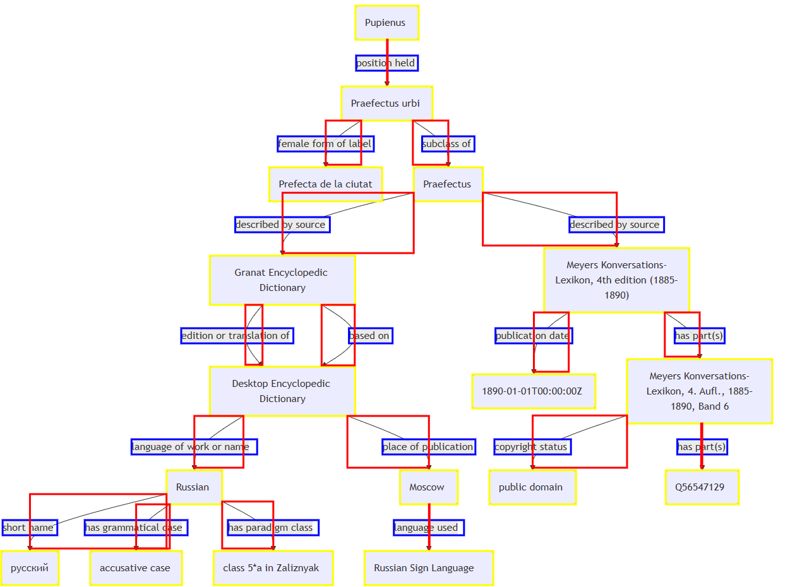
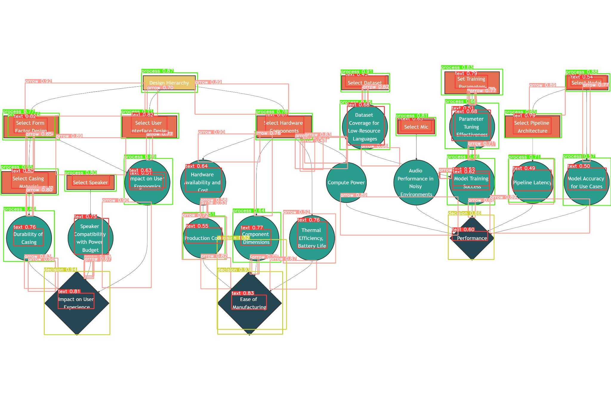

# 50.035-cv-project
Project Repository for Fall 2024 50.035 Computer Vision 

## Introduction

Understanding block diagrams is an often-overlooked challenge that requires complex functions such as deep-learning based computer vision and object detection methods. 

Conventional bounding box-based detection methods, especially those using CNN backbones, struggle to detect very short or axis-aligned line segments. 

In this project, we offer three contributions:
1. Benchmarked [Swin Transformer](https://arxiv.org/abs/2103.14030) as an object detection backbone and [YOLOv5](https://github.com/ultralytics/yolov5) against state-of-the-art methods [(Bhushan and Lee, 2022)](https://aclanthology.org/2022.findings-aacl.15/) on block diagram recognition.
2. Introduced a novel approach to data augmentation by automatically generating synthetic block diagrams using [Mermaid.js](https://mermaid.js.org/), enriched with structurally coherent triplets retrieved from an existing knowledge base, namely [Wikidata](https://www.wikidata.org/wiki/Wikidata:Main_Page). 
3. Improved the detection of handwritten and computer-generated block diagrams.

## Block Diagram Recognition

To use computer vision techniques to detect blocks, extract information from the blocks, identify relationships represented by arrows and connections, and create a structured representation of the diagram such as triplets – $\langle \mathit{head, relation, tail} \rangle$.

## Background

Block diagrams are used to visualize the relationships between entities to represent a larger part of a system, workflow or process. They are often found in technical documentation, software design documents, and other forms of documentation. 

The task of extracting block diagrams can be considered a subtask of document understanding, which is the task of extracting data from unstructured documents. By extracting the information and relationships between blocks from images, we enable downstream tasks such as knowledge graph construction, question answering, and summarization.

In [Bhusan and Lee, 2022](https://aclanthology.org/2022.findings-aacl.15/), Blosum uses the Inception-ResNet-v2 backbone in their model architecture to detect block diagrams.

## Data Augmentation

Example of Mermaid Generated Diagram with Derived Bounding Boxes

Code for generating synthetic diagrams can be found in the `data_augmentation` branch.

## Dataset

- **Computerized Block Diagram Dataset:** 502 diagrams, 13,000+ annotated elements.
- **Handwritten Dataset (FC-A):** Used for evaluating model generalization.

## Evaluation

- **Metrics:** Mean Average Precision (MAP), Mean Average Recall (MAR), F1-Score.
- **IoU Threshold:** 0.8 for detection tasks.
- **Testing:** Trained on computer-generated diagrams, evaluated on handwritten diagrams for generalizability.

Example of Predictions by YOLOv5 on Data Augmented Example

## Report
Detailed report can be found at `/report/report.pdf`.
